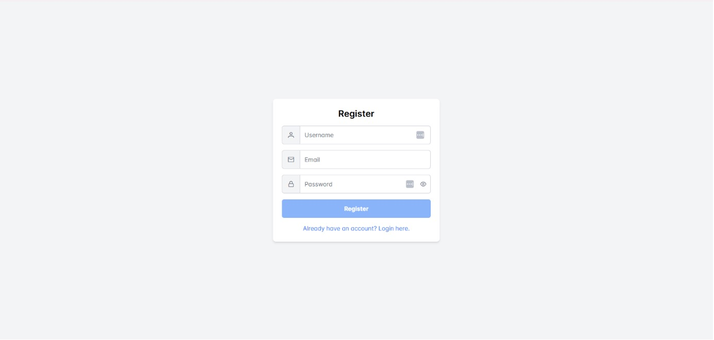
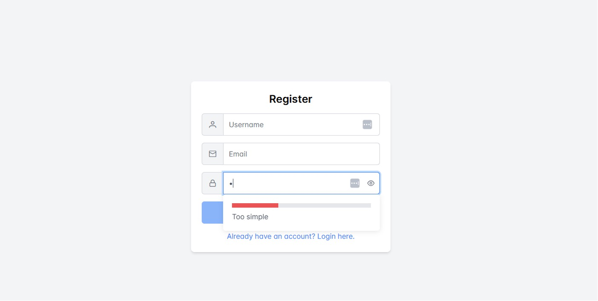
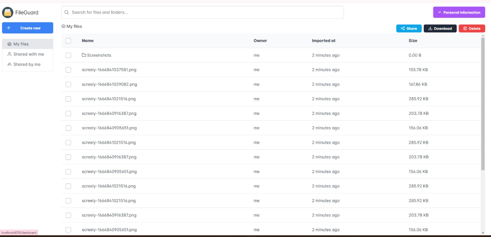
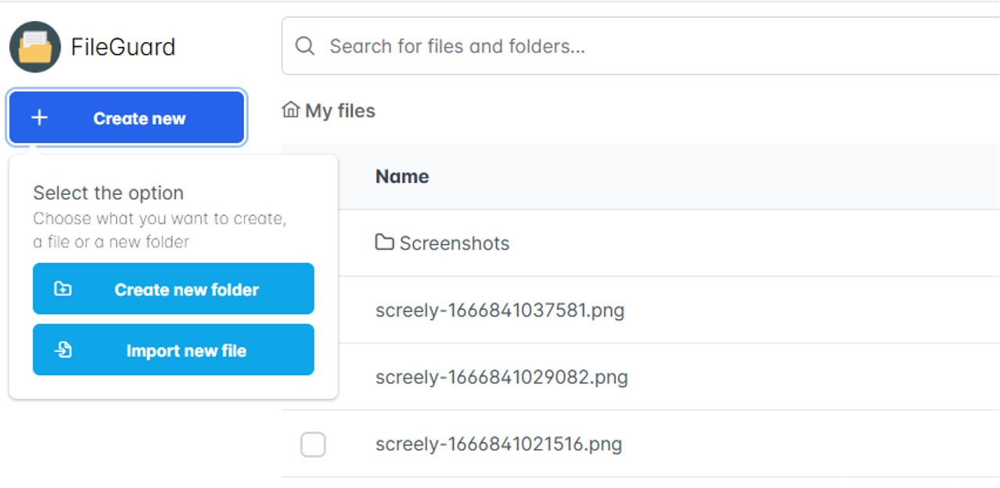
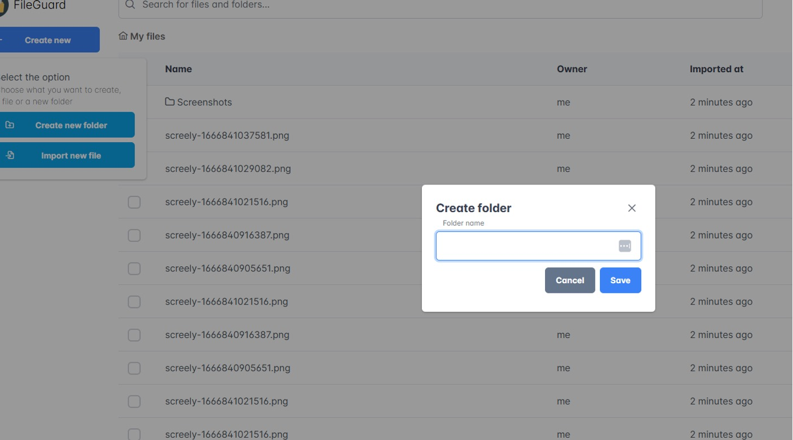
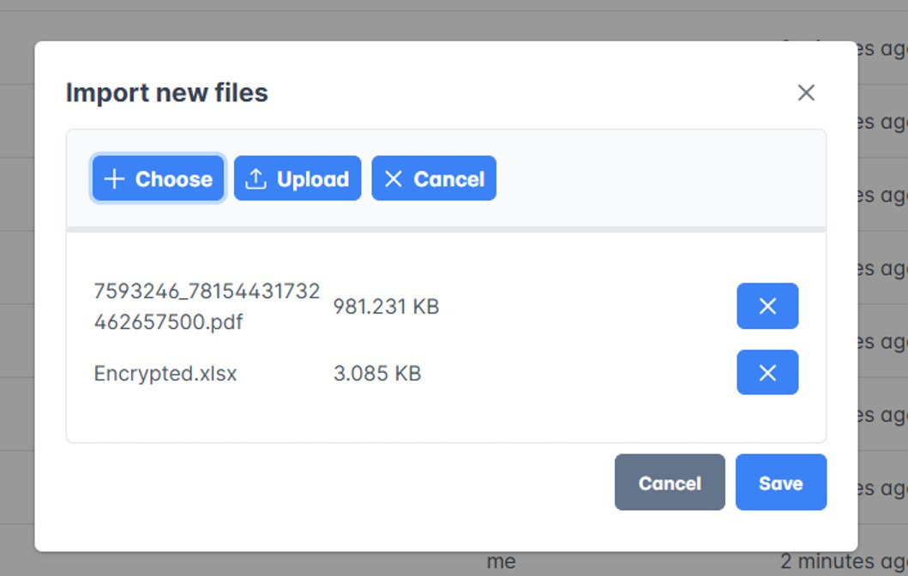

# encrypted-file-sharing-system

A secure web platform for uploading, encrypting, storing, and sharing files between users. The system uses modern cryptographic techniques to protect user data and manage file access securely.

---

## ⚙️ Key Features

- 📝 User registration with validation (email format, unique login, password strength)
- 🔐 JWT-based user authentication (Bearer Token)
- 📤 Uploading and encrypting files using AES
- 🔑 AES key & IV encrypted using RSA public key
- 📁 Folder creation and management
- 👥 Share files with other users via email or login
- ✅ Data integrity verification

---

## 📸 Feature Demonstration

This section demonstrates the core user experience on the platform: registration, login, file upload, folder creation, secure sharing, and encryption details.

### 1. 🔐 User Registration

Users register using their email (or login) and password. The form includes input validation.

  
*Registration form on desktop*

  
*Validation of form inputs*

---

### 2. 🔓 User Login

Users log in with their credentials. The platform returns a JWT token, which is used for authenticating future requests.

---

### 3. ☁️ File Upload and Encryption

Users can upload files from the **"My Files"** page. Files are automatically encrypted using AES. The AES key and IV are encrypted using the user's RSA public key before being stored securely.

  
*Main view of uploaded files*

  
*Option to upload files or create folders*

  
*Creating a new folder for file storage*

  
*Uploading new encrypted files*

---

### 4. 🤝 File Sharing

Users can share files with other users by entering their email or login. Shared files appear in the **"Files Shared With Me"** section, while files the user has shared appear in the **"Shared Files"** section.

---

## 🎬 Video Demo

